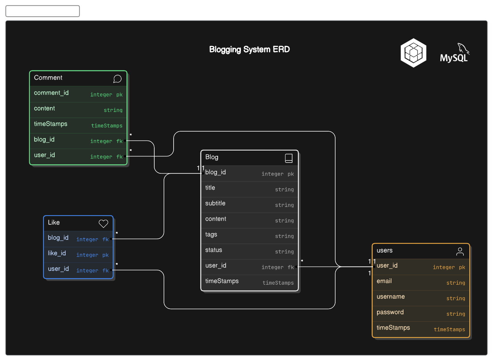

# Blog APIs using node.js, mySQL and Sequelize


File Structuring
----------------------------------------------------------------------------------------------

    .
    ├── ...
    ├── server.js
    ├── ...
    │
    ├── config           
    │   └── config.js  
    │   
    ├── models           
    │   └── index.js              
    │   └── User.js              
    │   └── ...  
    │       
    ├── src/routes           
    │   └── router.js 
    │   │  
    │   ├── users           
    │   │   └── userController.js              
    │   │   └── userRoute.js              
    │   └── ...         
    └── ...


ER Diagram
----------------------------------------------------------------------------------------------



Technologies
----------------------------------------------------------------------------------------------
- Sequelize
- Node.js
- Express
- MySQL


Get Started
----------------------------------------------------------------------------------------------

1. Clone Repo

```bash
git clone https://github.com/its-asif/Blog-APIs-using-mySQL-and-Sequelize.git
```

2. Install all dependencies

```bash
npm install
```

3. Start the server

```bash
node server.js
```


API testing with Postman
----------------------------------------------------------------------------------------------

###### provided postman collection json file for testing APIs

[Postman_collection.json](./dev-testing/sequelize.postman_collection.json)